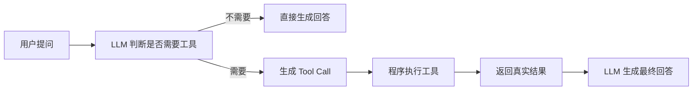
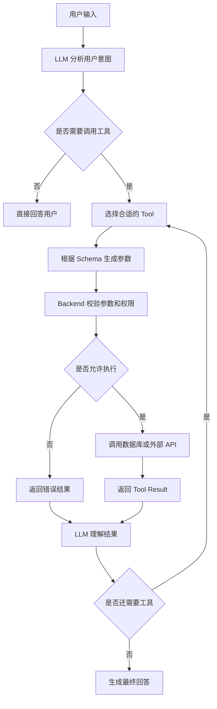
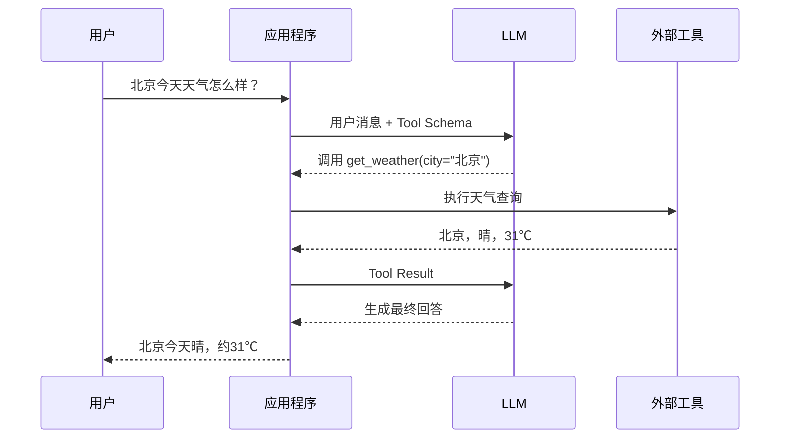
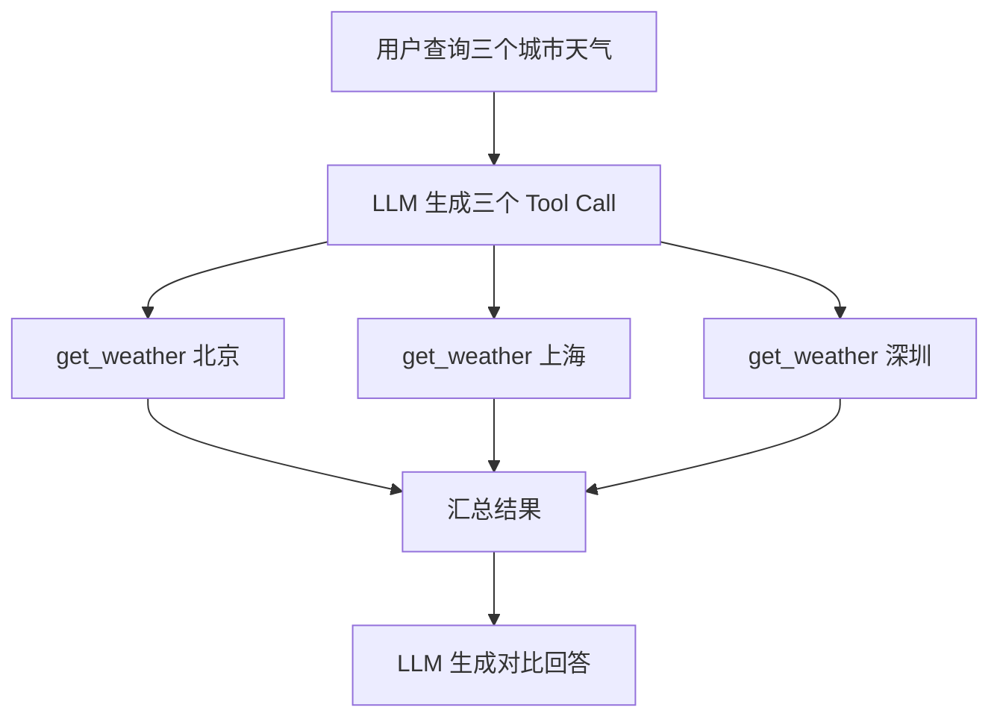
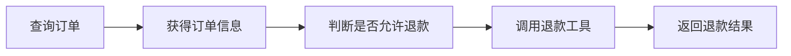
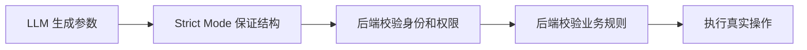
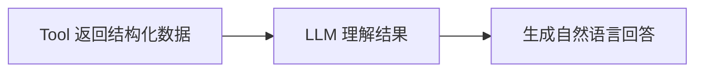
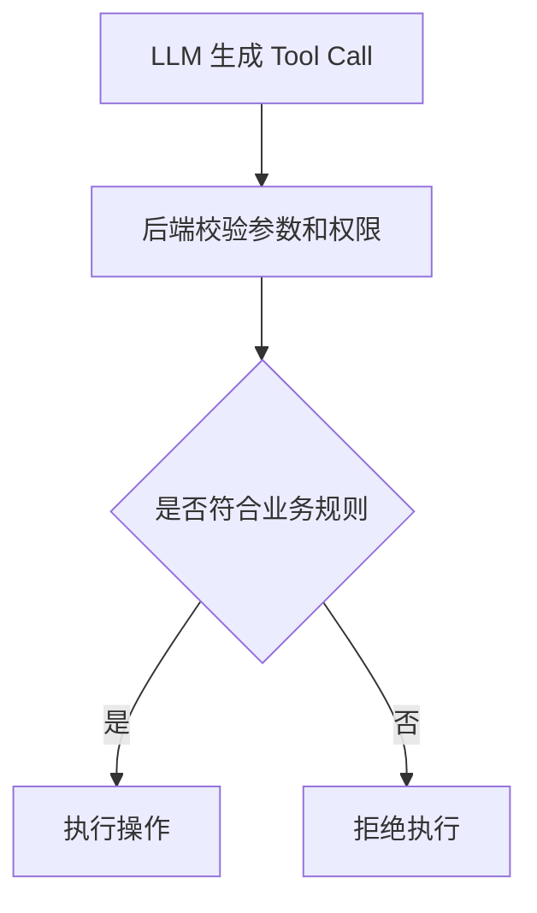

# Stage 1: 构建最小 Agent Loop

做之前，或者说在看官方资料之前，我认知里面的 Agent Loop 其实挺单纯的。

我觉得 Agent loop 应该是这样一个流程：
Input -> LLM think -> LLM Action -> Environment -> LLM observe

这里的 `think` 只是我给流程标出来的“决策 / 推理”阶段，不代表程序一定能拿到，或者需要展示模型内部思考。

具体拆解下来也就是：
- 用户给个输入内容
- 大语言模型 进行 `< think >`
- 然后根据 `< think >` 的结果进行 `< action >`
- 这个 `< action >` 的结果会反馈给环境，也就是 `< observe >` 环节
- 大语言模型接着进行 `< observe >`
- 然后大语言模型再根据 `< observe >` 到的东西继续去 `< think >`
- 这整个就是一个不断往复的循环
- 直到满足某个可以结束的条件，循环终止。

这就是个很简单、很直观的逻辑。
---

我参考的 Agent 入门资料：https://datawhalechina.github.io/hello-agents/#/./README

然后我开始带着这个想法去阅读这些官方资料：
- [OpenAI Function Calling](https://platform.openai.com/docs/guides/function-calling)
- [Gemini API Function Calling](https://ai.google.dev/gemini-api/docs/function-calling)
- [Claude Tool Use](https://docs.anthropic.com/en/docs/agents-and-tools/tool-use/overview)

看名字也就知道了，这三篇主要讲的都是 function call 以及 tool 调用。
那为什么做 Agent 必须要知道这两个东西，并且必须要学会呢？

想了想，主要原因是 LLM 只能输出文本，不能凭空完成现实操作，例如发送邮件或查询数据库。因此需要自行实现 function 或 tool，并定义协议，再用提示词约束模型输出可识别的格式和参数。程序负责真正调用、执行并回传结果，直到 LLM 判断任务完成并生成最终结果。

那么问题来了，到底该怎么在代码里构建一个 agent loop，以及如何进行 function call 呢？

先看看 GPT 的文章：
我看了一下，核心就是讲函数调用的。
工作原理与前面的理解一致：应用程序和模型通过 OpenAI API 进行一系列交互，官方资料将其描述为以下调用流程：
1. 使用模型对可以调用的工具发出请求
2. 接收到来自模型的工具调用（Tool Call）
3. 使用工具调用给出的输入参数，在应用程序端执行代码
4. 把工具执行完的输出再次发给模型，进行第二次请求
5. 最终接受模型的响应

主要是想看看更实际一点的代码是怎么写的。
GPT 官方提供了一个带工具的简单示例。下面这段保留的是调用流程伪代码，重点是看清 Tool Call 和 Tool Result 如何往返；真实运行时还要补完整 Schema、参数解析和错误处理：

```python
from openai import OpenAI
import json

client = OpenAI()
input_list = [{"role": "user", "content": "查询今天的星座运势"}]

# 1. 定义好模型能用的工具列表
tools = [{
    "type": "function",
    "name": "get_horoscope",
    "description": "Get today's horoscope for an astrological sign.",
    "parameters": { ... }
}]

# 2. 带着工具去请求模型
response = client.responses.create(model="gpt-5.6", tools=tools, input=input_list)

# 3. 拦截模型的函数调用请求，执行本地代码逻辑
while True:
    tool_calls = [item for item in response.output if item.type == "function_call"]
    if not tool_calls:
        print(response.output_text)
        break

    # 3. 保留模型输出，并执行本地工具
    input_list += response.output
    for item in tool_calls:
        args = json.loads(item.arguments)
        horoscope = get_horoscope(**args)

        # 4. Tool Result 必须关联原来的 call_id
        input_list.append({
            "type": "function_call_output",
            "call_id": item.call_id,
            "output": json.dumps(horoscope),
        })

    # 5. 带着 Tool Result 再次请求模型
    response = client.responses.create(model="gpt-5.6", tools=tools, input=input_list)
```

然后是 Anthropic Claude 的文章：
好吧，Claude Code 也是弄了个 client，它的逻辑长这样：
```python
client = anthropic.Anthropic()
tools = [{
    "name": "get_weather",
    "description": "Get the current weather for a given location.",
    "input_schema": { ... }
}]

# Claude 回复一个 tool_use 块
response = client.messages.create(model="claude-opus-5", tools=tools, messages=messages)
tool_use = next(block for block in response.content if block.type == "tool_use")

# 执行本地工具，返回 tool_result
weather = "15 degrees Celsius, partly cloudy"
messages += [
    {"role": "assistant", "content": response.content},
    {"role": "user", "content": [{"type": "tool_result", "tool_use_id": tool_use.id, "content": weather}]}
]
```

#### (3) Google Gemini 的实现思路
Gemini 的调用同样也是提供 `parameters`，并在返回的 `steps` 中解析 `function_call`：
```python
from google import genai
schedule_meeting_function = {
    "type": "function",
    "name": "schedule_meeting",
    "description": "Schedules a meeting...",
    "parameters": { ... }
}

interaction = client.interactions.create(
    model="gemini-3.6-flash",
    input="Schedule a meeting...",
    tools=[{"type": "function", **schedule_meeting_function}],
)

for step in interaction.steps:
    if step.type == "function_call":
        print(f"Function to call: {step.name}")
```

*(注：在查阅这些资料时，我也注意到了**上下文无关文法**等进阶概念，这些会在后续工程化中进一步强化。)*

---

# 个人看完资料的笔记和思考：

> 参考资料：
>
> - OpenAI Function Calling
> - Google Gemini Function Calling
> - Anthropic Claude Tool Use
>
> 三者核心思想几乎一致：
>
> **LLM 不负责执行代码，而是负责决定调用时机并生成参数；运行 Agent 的程序（Agent / Backend）负责真正执行工具。**

## 一、什么是 Function Calling？

Function Calling，也叫函数调用或工具调用，是大模型连接外部系统的一种机制。

普通大模型只能根据已有上下文生成文本。当用户问“北京今天天气怎么样”时，如果模型没有接入实时天气数据，它只能根据训练知识推测，无法保证答案准确。

```text
用户提问
   ↓
LLM 根据已有知识生成回答
   ↓
返回文本
```

Function Calling 让模型多了一种选择：当它发现仅靠自身知识无法完成任务时，可以请求程序调用一个外部工具。

例如，系统提前为模型提供了一个天气工具：

```text
get_weather(city)
```

用户提问：

```text
北京今天天气怎么样？
```

模型不会直接猜测天气，而是生成一个工具调用请求：

```json
{
  "name": "get_weather",
  "arguments": {
    "city": "北京"
  }
}
```

应用程序收到请求后，真正调用天气 API，并得到结果：

```json
{
  "city": "北京",
  "temperature": 31,
  "weather": "晴"
}
```

程序再把这个结果交给模型，模型最终组织成用户容易理解的回答：

```text
北京今天晴，气温约 31℃。
```

完整流程如下：



这里最重要的一点是：

> LLM 本身不会执行函数，也不会直接访问数据库或外部 API。它只负责选择工具并生成参数，真正的执行过程由应用程序完成。

------

## 二、函数调用的工作原理

一个完整的 Function Calling 系统通常包含四个角色：

```text
用户
  ↓
LLM
  ↓ Tool Call
应用程序 / Backend
  ↓
数据库、API、邮件、内部系统等外部能力
```

它们的职责并不相同。

### LLM 负责理解和决策

模型主要完成以下工作：

- 理解用户的真实意图；
- 判断是否需要调用工具；
- 从已有工具中选择合适的一个；
- 根据 Tool Schema 生成调用参数；
- 获取工具结果后，决定直接回答还是继续调用其他工具。

例如，用户说：

```text
帮我查询订单 10001 的状态。
```

模型需要判断：

1. 这是一个订单查询请求；
2. 应该选择 `search_order`；
3. 参数中的订单号是 `10001`；
4. 工具返回结果后，再向用户解释订单状态。

### Backend 负责执行和校验

后端负责真正连接外部系统，例如：

- 查询数据库；
- 调用第三方接口；
- 发送邮件；
- 创建工单；
- 修改订单；
- 调用内部业务系统；
- 返回结构化结果。

此外，后端还必须负责权限校验、参数验证和业务规则判断。模型提出调用请求，并不代表这个操作一定能够执行。

完整流程可以表示为：



这也是为什么 Function Calling 经常被看作 Agent 的基础能力。一次工具调用完成后，模型可以继续观察结果、再次判断、再次调用工具，直到任务完成。

```text
理解问题
   ↓
选择工具
   ↓
生成参数
   ↓
执行工具
   ↓
观察结果
   ↓
继续调用或结束
```

------

## 三、实现 Function Calling 的基本步骤

不同平台的字段名称略有区别，但 OpenAI、Gemini 和 Claude 的整体流程基本相同。

### 第一步：准备一个真实函数

首先，应用程序中必须存在真正可以执行的代码。

例如：

```ts
async function getWeather(city: string) {
  return weatherApi.getCurrentWeather(city);
}
```

这段代码负责真正访问天气服务。LLM 并不知道函数内部如何实现，也不会直接执行它。

### 第二步：定义 Tool Schema

接下来，需要用结构化方式向模型描述这个工具。

```json
{
  "name": "get_weather",
  "description": "查询指定城市当前的天气情况",
  "parameters": {
    "type": "object",
    "properties": {
      "city": {
        "type": "string",
        "description": "需要查询天气的城市名称"
      }
    },
    "required": ["city"]
  }
}
```

这份 Schema 主要告诉模型三件事：

- 工具叫什么；
- 工具适合解决什么问题；
- 调用工具时需要提供哪些参数。

需要注意，Tool Schema 只是工具的说明书，不是函数本身。

### 第三步：把用户消息和 Tools 一起发送给模型

请求模型时，需要同时提供：

```text
用户消息 + Tool Definitions
```

模型会结合用户需求和工具描述进行判断。

如果问题不需要工具，模型可以直接返回文本；如果需要工具，模型会返回 Tool Call。

### 第四步：解析模型返回的 Tool Call

模型可能返回：

```json
{
  "name": "get_weather",
  "arguments": {
    "city": "北京"
  }
}
```

此时只代表模型希望调用 `get_weather`，函数还没有真正执行。

应用程序需要读取函数名和参数，然后找到对应的本地实现。

```ts
switch (toolCall.name) {
  case "get_weather":
    result = await getWeather(toolCall.arguments.city);
    break;
}
```

### 第五步：执行工具并返回结果

函数执行后，应用程序会获得真实结果：

```json
{
  "city": "北京",
  "temperature": 31,
  "weather": "晴"
}
```

这个结果需要作为 Tool Result 再发送给模型。

### 第六步：让模型生成最终回答

模型结合原始问题和工具执行结果，生成自然语言回答：

```text
北京今天晴，气温约 31℃，出门注意防晒。
```

因此，完整实现通常不只是调用一次模型，而是至少包含两轮：



------

## 四、自定义 Tool 的方式

自定义 Tool，本质上就是把应用程序已有的能力，以模型能够理解的方式描述出来。

这些能力可以来自很多地方，例如：

- 数据库查询；
- CRM 或 ERP 系统；
- 飞书、Slack、邮箱；
- GitHub、TAPD、Jira；
- 搜索服务；
- 文件系统；
- 浏览器；
- 部署平台；
- 企业内部 API。

例如，可以把订单系统中的能力定义为：

```text
search_order()
create_order()
cancel_order()
refund_order()
```

也可以把企业协作能力定义为：

```text
send_email()
create_ticket()
query_tapd_task()
send_feishu_message()
```

### 一个 Tool 通常包含哪些内容？

一个比较完整的 Tool Schema 通常包含：

```text
name
description
parameters
properties
required
```

例如：

```json
{
  "name": "search_order",
  "description": "根据订单号查询单个订单的状态、金额和物流信息",
  "parameters": {
    "type": "object",
    "properties": {
      "order_id": {
        "type": "string",
        "description": "需要查询的订单号"
      }
    },
    "required": ["order_id"]
  }
}
```

其中，`description` 非常重要，因为模型会主要根据名称、描述和参数来判断是否应该调用这个工具。

描述不能只写：

```text
查询订单
```

更好的写法是：

```text
根据订单号查询单个订单的当前状态、支付金额和物流信息。当用户询问某个具体订单时使用。
```

如果存在功能相近的工具，还需要明确工具之间的边界。

```text
search_order：
根据订单号查询一个具体订单。

list_user_orders：
根据用户 ID 查询该用户的历史订单列表。
```

这样可以降低模型选错工具的概率。

### Tool 的实际接入方式

在应用程序中，通常会维护一份工具注册表：

```ts
const toolHandlers = {
  get_weather: getWeather,
  search_order: searchOrder,
  send_email: sendEmail
};
```

模型返回工具名称后，程序通过注册表找到对应函数：

```ts
const handler = toolHandlers[toolCall.name];

if (!handler) {
  throw new Error("未知工具");
}

const result = await handler(toolCall.arguments);
```

因此，自定义 Tool 实际上分为两部分：

```text
Tool Schema：提供给模型，用来理解和选择工具。

Tool Handler：保存在后端，用来真正执行工具。
```

------

## 五、单工具、多工具与工具调用循环

### 单工具调用

简单任务通常只需要调用一次工具。

例如：

```text
用户：查询北京天气
模型：调用 get_weather("北京")
工具：返回天气结果
模型：生成最终回答
```

### 并行工具调用

当多个工具之间互不依赖时，可以并行执行。

例如：

```text
查询北京、上海和深圳今天的天气。
```

模型可以一次返回三个调用：

```text
get_weather("北京")
get_weather("上海")
get_weather("深圳")
```

程序并行执行后，再把所有结果交给模型汇总。



这种方式适合：

- 查询多个城市天气；
- 同时查询多只股票；
- 从多个数据源获取信息；
- 同时读取多个互不依赖的文件。

### 串行工具调用

如果后一个工具依赖前一个工具的结果，就必须串行执行。

例如：

```text
帮我查询订单，然后申请退款。
```

模型可能先调用：

```text
search_order(order_id)
```

拿到订单状态和金额后，再调用：

```text
refund_order(order_id, amount)
```



这种场景中，模型可能经历多轮工具调用。

```text
用户请求
   ↓
调用工具 A
   ↓
观察结果
   ↓
调用工具 B
   ↓
观察结果
   ↓
完成任务
```

因此，Agent 并不只是“调用一个函数”，而是围绕目标持续执行：

```text
Observe → Think → Act → Observe
```

直到模型认为已经获得足够信息，可以向用户返回最终结果。

------

## 六、Strict Mode 是什么？

Strict Mode 是 OpenAI Function Calling 中用于约束工具参数输出的一种机制。

开启方式通常是在完整 Tool 定义中设置。下面是 Responses API 风格的最小形状：

```json
{
  "type": "function",
  "name": "get_weather",
  "strict": true,
  "parameters": {
    "type": "object",
    "properties": {
      "city": { "type": "string" }
    },
    "required": ["city"],
    "additionalProperties": false
  }
}
```

它的主要作用是要求模型生成的参数严格符合指定的 JSON Schema。

开启 Strict Mode 后，模型应该返回：

```json
{
  "city": "北京"
}
```

而不是返回错误字段：

```json
{
  "location": "北京"
}
```

也不能返回错误类型：

```json
{
  "city": 123
}
```

Strict Mode 主要解决的是结构稳定性问题，例如：

- 字段名写错；
- 缺少必填字段；
- 参数类型错误；
- 生成 Schema 中不存在的字段。

但它不能保证参数在业务上一定正确。

例如，下面的参数可能完全符合 Schema：

```json
{
  "order_id": "ORDER_99999",
  "refund_amount": 1000
}
```

但仍然可能存在以下问题：

- 订单并不存在；
- 当前用户无权操作；
- 订单不支持退款；
- 退款金额超过实际支付金额；
- 订单已经退款过。

因此，Strict Mode 只能保证：

> 模型生成的参数遵守声明的 Schema。

同时需要注意：严格模式要求每个对象声明 `additionalProperties: false`，并将 `properties` 中的字段全部写进 `required`。想保留可选字段时，可以使用包含 `null` 的类型表达“字段存在但值为空”。不同 API 的 Tool 外层形状略有区别；当前 Stage1 的 DeepSeek 代码走的是 Chat Completions 风格。

它不能替代：

- 后端参数校验；
- 用户身份校验；
- 权限校验；
- 业务状态校验；
- 幂等性校验。

可以把整个校验过程理解为：



因此，在生产环境中，比较合理的做法是：

```text
Strict Mode 负责减少模型输出格式错误。

Backend 负责保证业务安全和数据正确。
```

## 七、函数调用的注意事项

### 1. Tool 职责要清晰

不要设计一个过于模糊的工具：

```ts
manage_order()
```

更适合按照完整业务动作拆分：

```ts
search_order()
cancel_order()
refund_order()
create_order()
```

但也不是拆得越细越好。一个 Tool 最好对应一个清晰、完整、可以独立执行的业务动作。

### 2. Tool 描述和参数要明确

模型主要根据 Tool 名称、Description 和参数 Schema 来判断是否调用。

例如，不要只写：

```text
查询订单
```

应该写清楚：

```text
根据订单号查询订单状态、金额和物流信息。
```

参数也尽量使用 `required`、`enum`、`minimum` 和 `additionalProperties: false` 等约束，减少模型生成错误参数的概率。

### 3. 后端必须再次校验

即使 Tool Call 符合 Schema，也不能直接执行。后端仍然需要检查：

- 用户身份和操作权限
- 参数范围和资源是否存在
- 当前业务状态是否允许操作
- 是否存在 SQL 注入或危险命令

模型只能提出调用请求，最终能否执行，必须由后端决定。

### 4. 写操作要考虑重复调用

退款、支付、创建订单等操作，可能因为超时或重试被执行多次，因此要设计幂等机制。

例如，通过唯一的 `idempotency_key` 判断请求是否已经处理，避免重复退款或重复创建订单。

### 5. Tool Result 要精简、结构化

Tool 不需要返回整个数据库记录，只返回当前任务需要的信息。

例如：

```json
{
  "order_id": "ORDER_10001",
  "status": "shipped",
  "estimated_delivery_date": "2026-07-29"
}
```

这样既能减少 Token 消耗，也能避免敏感数据泄露。

### 6. Tool 返回数据，LLM 负责表达

Tool 负责返回事实和执行结果，LLM 负责把结果组织成自然语言。



例如 Tool 返回：

```json
{
  "temperature": 31,
  "condition": "晴"
}
```

LLM 再回答：

```text
北京今天晴，气温约 31℃，出门注意防晒。
```

### 7. 核心业务规则必须写在后端

Prompt 可以提醒模型“退款金额不能超过 100 元”，但真正的限制必须写在代码中：

```ts
if (amount > 100) {
  throw new Error("退款金额超过自动退款上限");
}
```

Prompt 只能引导模型，后端代码才是真正的安全边界。



核心原则可以概括为：

> LLM 负责选择工具和生成参数，后端负责校验、执行和保证安全。


结合前面三份函数调用资料，我整理并写出了一个最小 Agent。

# 本阶段的记录和产物

**产出**：一个 50-150 行的最小 agent，可以选择工具、执行工具、返回最终答案。
[代码实现已产出：minial_agent.js](./minial_agent.js)

本阶段统一使用：
Node.js
JavaScript
OpenAI JavaScript SDK
DeepSeek API
Chat Completions

- [x] **已用一个 LLM API 完成普通对话。**
1. 创建项目

配置密钥等

2. 初始化客户端
```js
import "dotenv/config";
import OpenAI from "openai";

const client = new OpenAI({
  apiKey: process.env.DEEPSEEK_API_KEY,
  baseURL: "https://api.deepseek.com",
});
```

3. 完成一个最简单的对话
```js
import "dotenv/config";
import OpenAI from "openai";

const client = new OpenAI({
  apiKey: process.env.DEEPSEEK_API_KEY,
  baseURL: "https://api.deepseek.com",
});

async function chat(userMessage) {
  const response = await client.chat.completions.create({
    model: "deepseek-chat",
    messages: [ 
      // 对话历史
      // system，user，assistant，tool
      {
        role: "system",
        content: "角色：JavaScript 学习助手。回答应准确、简洁，并给出必要的示例。",
      },
      {
        role: "user",
        content: userMessage,
      },
    ],
  });

  const answer = response.choices[0].message.content;
  console.log(answer);
}
chat("请用简单的话解释什么是闭包。");

```

4. 保存对话历史
```js
//如果第二次请求没有把第一次对话传进去，模型通常不知道用户叫 Peter
//正确方式是维护一个数组：
const messages = [
  {
    role: "system",
    content: "角色：通用助手。回答应准确、简洁。",
  },
];

async function chat(userMessage) {
  messages.push({
    role: "user",
    content: userMessage,
  });

  const response = await client.chat.completions.create({
    model: "deepseek-chat",
    messages,
  });

  const assistantMessage = response.choices[0].message;

  messages.push(assistantMessage);

  return assistantMessage.content;
}

```

- [ ] **单独使用 Structured Outputs 让最终回答稳定输出 JSON。**

这部分还没有单独完成。这里需要区分两种情况：
1. 用提示词要求 JSON，再自行解析和捕获错误；
2. 用 `response_format` / JSON Schema 约束最终回答的结构；
3. Function Calling 约束的是工具调用参数，也可以调用外部工具，但不等于最终回答自动成为结构化 JSON。

结构化输出不是为了让回答“看起来整齐”。

它的真正用途是：

模型自然语言能力
        ↓
转换成程序可读取的数据
        ↓
程序根据数据继续执行

例如：

{
  "action": "create_task",
  "title": "修复登录页面",
  "assignee": "Peter",
  "priority": "high"
}


- [x] 已定义一个工具函数，例如 calculator。
1. 工具只是普通 JavaScript 函数，里面有方法并且有参数
2. 工具函数和工具描述不是同一个东西
工具函数是程序真正执行的代码
工具描述是告诉模型如何调用工具的 一份 JSON Schema ，有固定的格式

3. JSON Schema 每一部分是什么意思
type
name
description
parameters
properties
required
enum


4. 工具设计原则
工具应该：

名字明确；
描述明确；
参数少而清晰；
每个参数有说明；
尽量限制可选值；
工具只承担一个职责；
返回容易理解的数据。

- [x] 已解析模型的 tool call / function call。
现在把工具定义传给模型。

```js
const response = await client.chat.completions.create({
  model: "deepseek-chat",
  messages: [
    {
      role: "user",
      content: "帮我计算 2345 乘以 6789",
    },
  ],
  tools,
  tool_choice: "auto",
});
```

tool_choice: "auto" 表示：

模型自己判断：
1. 直接回答；
```
{
  role: "assistant",
  content: "2345 乘以 6789 等于……",
  tool_calls: undefined
}
```
2. 或调用某个工具。
```
{
  role: "assistant",
  content: null,
  tool_calls: [
    {
      id: "call_abc123",
      type: "function",
      function: {
        name: "calculator",
        arguments:
          '{"operation":"multiply","a":2345,"b":6789}'
      }
    }
  ]
}
```


- [x] 已执行工具，并把工具结果喂回模型。

实现中通过循环追加 `messages`，并保留 assistant 的工具调用消息。

- [x] 已给 agent loop 加入最大步数、超时和错误处理。
